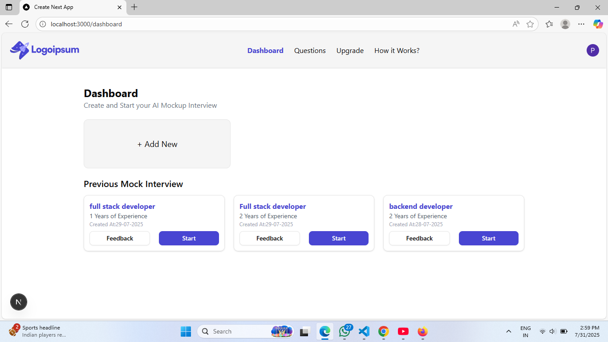
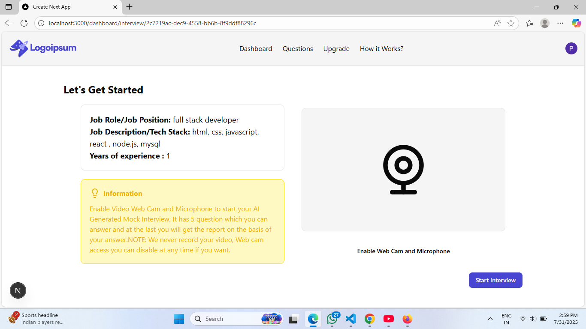
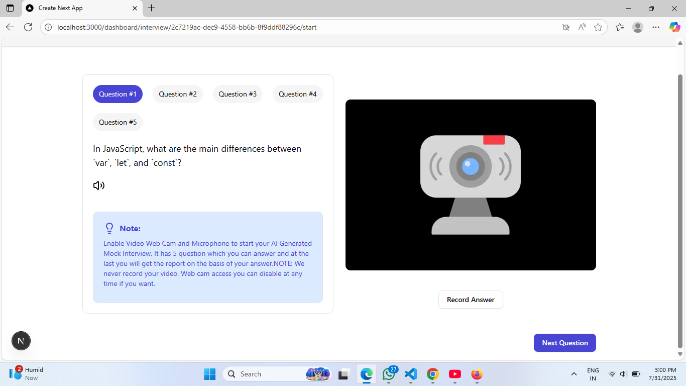

# 🎯 AI Mock Interview App

An intelligent, full-stack **AI mock interview platform** built with modern technologies like **Next.js**, **PostgreSQL**, **Clerk**, and **Gemini AI**. This app helps job seekers, students, and professionals simulate real interview scenarios and get instant feedback on their responses — making it a **highly practical and impactful tool**.


---

## 🔗 Live Demo

👉 Try it live: [https://ai-mock-interview-app-swart.vercel.app](https://ai-mock-interview-app-swart.vercel.app)

---

## 🔥 Why This Project Matters

- 👨‍💻 **Real-World Use Case**: Helps users prepare for technical interviews based on job role and experience.
- 🧠 **AI Integration**: Uses Gemini AI to generate domain-specific questions and smart feedback.
- 💼 **Resume-Boosting App**: Demonstrates real skills in full-stack development, authentication, AI usage, and DB design.
- 📈 **Scalable Design**: Built with modular architecture — ready for production-level deployment and future expansion.

---

## 🛠 What You Can Do with This App

✅ Sign up securely and log in using Clerk  
✅ Enter job role, experience, and description to generate a custom interview  
✅ Answer questions directly in the browser  
✅ Receive AI-generated feedback, ratings, and suggestions  
✅ View and manage past interview sessions from your dashboard  
✅ Fully responsive interface (mobile + desktop)  

---

## 💡 Use Cases

- 🎓 Students preparing for placements  
- 💼 Professionals switching roles or companies  
- 🚀 Developers building interview prep platforms  
- 🧪 Educators conducting AI-based mock sessions  

---

## 📸 App Walkthrough

1. **User Dashboard**
   - See your interview history and create new ones  
   

2. **Generate Mock Interview**
   - Provide role details to fetch AI-generated questions  
   

3. **Answer Questions**
   - View one question at a time and record text/audio responses  
   

4. **AI Feedback**
   - After answering, get rated and reviewed by Gemini AI  
   

---

## 📚 Key Skills Demonstrated

- ✅ Full Stack Web Development with Next.js (React-based SSR)  
- ✅ Integration of third-party AI APIs (Gemini / LLMs)  
- ✅ Role-based & dynamic UI design using Tailwind + ShadCN  
- ✅ Auth & session management with Clerk  
- ✅ Relational database schema design with Drizzle ORM & PostgreSQL  
- ✅ Realtime interaction, state handling, and modular architecture  

---

## 🛠️ Getting Started

### 1️⃣ Clone the Repository
```bash
git clone https://github.com/PurvaLenekar/ai-mock-interview-app.git
cd ai-mock-interview-app
